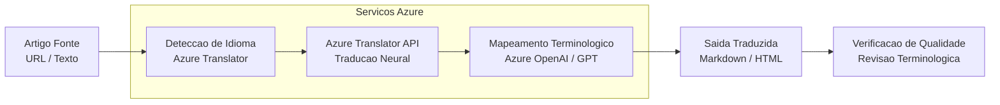

# Tradutor de Artigos Tecnicos com Azure AI

<div align="center">


</div>


## Descricao

Este projeto implementa uma solucao de traducao automatica de artigos tecnicos utilizando os servicos de IA do Azure (Azure OpenAI e Azure Translator). O foco principal e garantir precisao terminologica e contexto especifico do dominio tecnico, facilitando o acesso a conteudos especializados em diferentes idiomas.

## Arquitetura da Solucao



## Tecnologias Utilizadas

- **Python 3.10+**
- **Azure Translator API** - Servico de traducao neural
- **Azure OpenAI Service** - Refinamento com GPT para contexto tecnico
- **Azure Blob Storage** - Armazenamento de artigos
- **Streamlit** - Interface web para interacao

## Funcionalidades

1. **Traducao de artigos tecnicos** a partir de URL ou texto
2. **Preservacao de formatacao** Markdown e HTML
3. **Refinamento terminologico** usando Azure OpenAI para precisao tecnica
4. **Suporte multi-idioma** com foco em EN<->PT-BR
5. **Interface web** intuitiva com Streamlit

## Estrutura do Projeto

```
tradutor-artigos-tecnicos-azureai/
|-- src/
|   |-- translator.py       # Modulo principal de traducao
|   |-- azure_config.py     # Configuracao dos servicos Azure
|   |-- text_extractor.py   # Extracao de conteudo de URLs
|   |-- refinement.py       # Refinamento com OpenAI
|-- app.py                  # Aplicacao Streamlit
|-- requirements.txt        # Dependencias
|-- .env.example            # Exemplo de variaveis de ambiente
|-- README.md
```

## Pre-requisitos

- Conta Azure com os seguintes servicos provisionados:
  - Azure Translator (Cognitive Services)
  - Azure OpenAI Service
- Python 3.10 ou superior
- pip (gerenciador de pacotes Python)

## Configuracao

1. Clone o repositorio:
```bash
git clone https://github.com/galafis/tradutor-artigos-tecnicos-azureai.git
cd tradutor-artigos-tecnicos-azureai
```

2. Instale as dependencias:
```bash
pip install -r requirements.txt
```

3. Configure as variaveis de ambiente:
```bash
cp .env.example .env
```

Edite o arquivo `.env` com suas credenciais Azure:
```
AZURE_TRANSLATOR_KEY=sua_chave_translator
AZURE_TRANSLATOR_ENDPOINT=seu_endpoint_translator
AZURE_TRANSLATOR_REGION=sua_regiao
AZURE_OPENAI_KEY=sua_chave_openai
AZURE_OPENAI_ENDPOINT=seu_endpoint_openai
AZURE_OPENAI_DEPLOYMENT=nome_do_deployment
```

4. Execute a aplicacao:
```bash
streamlit run app.py
```

## Como Usar

1. Acesse a interface web pelo navegador
2. Insira a URL do artigo tecnico ou cole o texto diretamente
3. Selecione o idioma de destino
4. Clique em "Traduzir"
5. Visualize e exporte o artigo traduzido

## Projeto desenvolvido como parte do Microsoft Certification Challenge #4 - AI-102 na plataforma DIO.


---

## English

### Overview

Tradutor de Artigos Tecnicos com Azure AI - A project built with Python, HTML, Azure, developed by Gabriel Demetrios Lafis as part of professional portfolio and continuous learning in Data Science and Software Engineering.

### Key Features

This project demonstrates practical application of modern development concepts including clean code architecture, responsive design patterns, and industry-standard best practices. The implementation showcases real-world problem solving with production-ready code quality.

### How to Run

1. Clone the repository:
   ```bash
   git clone https://github.com/galafis/tradutor-artigos-tecnicos-azureai.git
   ```
2. Follow the setup instructions in the Portuguese section above.

### License

This project is licensed under the MIT License. See the [LICENSE](LICENSE) file for details.

---

Developed by [Gabriel Demetrios Lafis](https://github.com/galafis)
